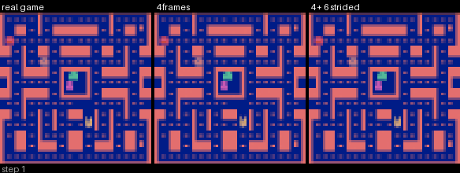
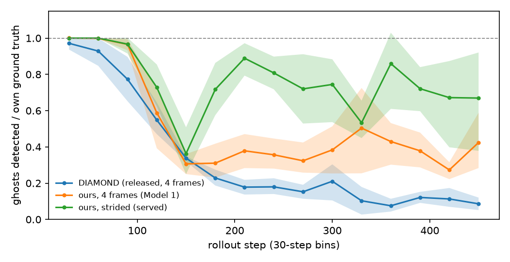

# pacworld

A playable neural world model of Ms. Pac-Man: an action-conditioned diffusion model in the style of
[DIAMOND](https://arxiv.org/abs/2405.12399) that predicts the next frame from the last few frames and the
player's action. There is no game engine underneath — you play inside the model, in the browser, at 15 fps.

<!-- DEMO GIF SLOT: drop the recording in docs/demo.gif and uncomment.
     Training also writes a short rollout beside ground truth to outputs/<run>/rollout_<step>.gif.

-->

## What is here

The model is a 19M-parameter EDM diffusion UNet over the noisy next frame plus its context frames, conditioned on
the actions, at 64x64. Everything else in the repo exists to answer one question: *how far can you walk around
inside it before the world stops making sense?*

**The main finding: the long-horizon failures are hidden timers.** Ms. Pac-Man runs clocks the screen does not
show: how long ghosts stay in the pen after a death (up to 91 steps), and how long a power pellet lasts (124-134
steps). A model that sees only its last 4 frames cannot observe them, so it parks the ghosts in the pen. A context
with the same kind of frames but a longer *reach* (4 recent frames plus 6 frames 16 steps apart, spanning 97 steps)
removes the parking. The frightened-phase timer is still unsolved.

**How the work was done.** Every experiment was pre-registered: its pass/fail criteria were committed before its
results existed, and failed predictions are reported as failures. Confidence intervals are 95% bootstrap intervals
over held-out *episodes*, not rollouts. The full log is [`notes/handoff.md`](notes/handoff.md); a paper draft is in
[`paper/`](paper/).

## Results

Rollouts of 450 steps (30 s) from 10 held-out episodes x 3 sampler seeds, replaying the recorded actions
([`eval/eval_rollouts.py`](eval/eval_rollouts.py)). Brackets are 95% CIs over the 10 episodes
([`eval/bootstrap_ci.py`](eval/bootstrap_ci.py), [`eval/pen_bootstrap.py`](eval/pen_bootstrap.py)). With 10
episodes the intervals are wide, and several differences that look real in the point estimates are not.

### The pen timer

How long the ghost pen stays occupied in a 450-step rollout:

| model | context | rollouts parked 200+ steps | longest pen stay, median |
|---|---|---|---|
| real game | - | 0 / 30 | 78 |
| Model 1 (200k frames) | 4 consecutive | 16 / 30 [0.37, 0.70] | 222 [188, 299] |
| ctx4 (2.2M frames) | 4 consecutive | 17 / 30 [0.37, 0.77] | 238.5 [150, 287] |
| ctx8 | 8 consecutive | 23 / 30 [0.63, 0.90] | 324 [282, 349] |
| **ctx6s16** | **4 + 6 @ stride 16 (reach 97)** | **0 / 30**\* | **82** [73, 93] |
| ctx6s16 + LR anneal (served) | 4 + 6 @ stride 16 | 0 / 30\* | 70 [65, 75] |

\* No rollout parked in any of the 10 episodes, so the bootstrap interval is degenerate. The exact one-sided 95%
upper bound on the per-episode parking rate is 0.26.

- **The strided context removes the parking.** Parked fraction, ctx6s16 minus ctx4 on the same episodes: **−0.57
  [−0.77, −0.37]**. In 900-step rollouts: −0.83 [−0.93, −0.73].
- **No clear evidence that 8 consecutive frames park more than 4**: +0.20 [−0.10, +0.47].
- **No clear evidence that 10x more data changes parking**: +0.03 [−0.20, +0.27].

### Coherence at 450 steps

| model | context | wall IoU | pellet IoU | Pac-Man err (px) | responsiveness | ghosts / ground truth |
|---|---|---|---|---|---|---|
| Model 1 (200k frames) | 4 consecutive | 0.958 [0.957, 0.960] | 0.839 [0.821, 0.853] | 19.5 [13.3, 25.4] | 0.30 [0.23, 0.38] | 0.41 [0.25, 0.61] |
| ctx4 (2.2M frames) | 4 consecutive | 0.959 [0.955, 0.962] | 0.848 [0.828, 0.872] | 19.0 [13.2, 24.8] | 0.37 [0.28, 0.47] | 0.50 [0.31, 0.69] |
| ctx8 | 8 consecutive | 0.960 [0.958, 0.962] | 0.829 [0.808, 0.852] | 19.1 [12.6, 25.2] | 0.38 [0.26, 0.51] | 0.37 [0.23, 0.50] |
| **ctx6s16** | 4 + 6 @ stride 16 | 0.952 [0.949, 0.956] | 0.843 [0.816, 0.869] | 13.7 [9.1, 18.6] | 0.39 [0.36, 0.41] | 0.51 [0.25, 0.71] |
| **+ LR anneal** (served) | 4 + 6 @ stride 16 | 0.955 [0.953, 0.958] | 0.845 [0.825, 0.864] | 14.6 [10.4, 19.3] | 0.43 [0.40, 0.46] | 0.58 [0.30, 0.87] |
| at 128x128 | 4 + 6 @ stride 16 | 0.970 [0.964, 0.976] | 0.831 [0.799, 0.865] | 22.7† [15.4, 29.8] | 0.26 [0.23, 0.29] | 0.51 [0.29, 0.73] |

Paired differences on the same episodes:

- **Supported:**
  - strided context lowers Pac-Man error: −5.3 px [−11.6, −0.5] against ctx4;
  - the LR anneal improves responsiveness: +0.044 [+0.009, +0.080];
  - 10x data improves responsiveness: +0.071 [+0.014, +0.129].
- **Not supported:**
  - no clear evidence that 10x data lowers Pac-Man error (−0.5 px [−2.7, +1.3]) or changes any other metric here;
  - no clear evidence of any difference in ghost count between our models.
- **128x128 is sharper per step but drifts faster**: Pac-Man error +8.2 px [+1.9, +13.9] and responsiveness −0.17
  [−0.22, −0.13] against the 64px model, so the 64px model is the one served.

† In 64px-equivalent units. Pen numbers are not comparable across resolutions: the occupancy measure is not
resolution-invariant.

### The second timer is not solved

The frightened phase lasts 124-134 steps, beyond the 97-step reach. No model ends it on time. A model with a 145-step
reach ended frightened phases too early and weakened the pen timer. Three pre-registered attempts to fix it failed;
they are in the handoff.

## The hidden-timer rule, tested on a synthetic game

**The rule.** A frame model can time a hidden event of period N only as precisely as its context offsets resolve −N:
exactly if a context frame sits at −N, spread out if −N falls between two context frames, and not at all if N is
beyond the reach.

**The test** ([`notes/timer_rule_design.md`](notes/timer_rule_design.md), [`timer_game.py`](timer_game.py)). A 16x16
game holds a ghost in a pen for exactly N frames with nothing on screen showing the elapsed time. 23 small models
cross three context layouts (4 consecutive, 10 consecutive, and the strided 10-frame layout) with N from 3 to 200.
Each is compared with an *ideal observer* limited to the same context offsets, computed before any model trained.

**Verdict, as pre-registered: the rule holds PARTIALLY. Reach is necessary but not sufficient.**

| cells | what was required | result |
|---|---|---|
| 10 with N beyond the reach | no better than an observer that cannot see the capture | **10 / 10 pass** |
| 9 with a context frame exactly at −N | on-time fraction near the ideal observer's | **8 / 9 pass** |
| 3 with −N between two context frames | releases about as often and as accurately as the observer | **2 / 3 pass** |

- **Beyond the reach, no model timed anything.** They mostly park instead: they release in 0.12-0.30 of starts at
  long periods, where the ideal observer releases in 0.89-0.98. This reproduces the Ms. Pac-Man pen parking in a game
  with no other cause.
  - This criterion is one-sided, and parking passes it. It shows that no model beat a blind observer, not that the
    models behave like one.
- **With a frame exactly at −N, timing matches the ideal observer** at N = 17, 33 and 65 with the strided layout:
  0.87 [0.77, 0.95], 0.87 [0.77, 0.95] and 0.82 [0.68, 0.92] on time, against 0.90, 0.86 and 0.80.
- **Two in-reach cells fail.**
  - N = 97, the farthest frame: on time in 0.167 [0.067, 0.267] against a bar of 0.199. Even the ideal observer
    manages only 0.30 there.
  - N = 80, between two frames: the model parks in 37 of 60 starts. Its release fraction is 0.38 [0.27, 0.50] against
    a bar of 0.49.

The per-cell table is in the handoff and the paper draft.

## External reference point: DIAMOND's released model

We ran DIAMOND's released Atari-100k Ms. Pac-Man world model in our harness, without retraining
([`eval/diamond_baseline.py`](eval/diamond_baseline.py), [`notes/diamond_baseline.md`](notes/diamond_baseline.md)).

**The pre-registered prediction failed.** We predicted that DIAMOND's 4-frame context would park ghosts in at least
10 of 30 rollouts. It parked in **0 of 30**.

**Why this does not test the rule either way.** Parking can only be measured while ghosts exist, and DIAMOND's ghosts
vanish:



| ghosts / own ground truth | steps 1-15 | at 150 | at 450 |
|---|---|---|---|
| DIAMOND | 0.99 [0.97, 1.01] | 0.30 [0.26, 0.37] | **0.08 [0.05, 0.10]** |
| ours, 4 frames (Model 1) | 1.00 | 0.24 [0.13, 0.34] | 0.41 [0.25, 0.61] |
| ours, strided (served) | 1.00 | 0.47 [0.25, 0.67] | 0.58 [0.30, 0.87] |

- **The vanishing is not a detector artifact.** The detectors were rebuilt for DIAMOND's frame format. In the first
  15 steps they find 0.99 [0.97, 1.01] of the ghosts of DIAMOND's own ground truth in DIAMOND's generated frames, and
  3.86 ghosts per ground-truth frame where 4 should be visible. Later frames show the maze, pellets and Pac-Man
  intact, with no ghosts ([`eval/ghost_ratio_plot.py`](eval/ghost_ratio_plot.py)).
- **Other metrics at 450 steps:** DIAMOND keeps the walls best (wall IoU 1.000 [0.995, 1.004] of its own ceiling). It
  has higher Pac-Man error (25.3 px [19.1, 31.2]) and lower responsiveness (0.18 [0.13, 0.24]) than our served model.

**This is a reference point, not a head-to-head.** The two models differ in ways that favour ours on this test:

| | DIAMOND (released) | ours (served) |
|---|---|---|
| purpose | 15-step imagination for RL training | long interactive rollouts |
| training data | 100k agent steps of its own RL agent, episodes ending at each life loss | 2.2M frames from a PPO agent with exploration |
| amount | about 1/20 of ours | - |
| model | 4.4M parameters, 4 frames | 18.8M parameters, 10 strided frames |
| frames | full screen, 2-frame pooling | maze crop, 4-frame pooling |

A 450-step rollout is 30 times DIAMOND's design horizon.

## Learned controls (latent actions): a negative result

We tried a Genie-style extension: a latent action model that infers 8 discrete codes from frames alone, so the world
model could be trained without action labels ([`notes/latent_actions_design.md`](notes/latent_actions_design.md),
[`lam.py`](lam.py)). Two variants were trained: one generic, and one that weights its reconstruction loss around
Pac-Man using the pixel detector. The detector uses no action labels or RAM, but it does tell that variant which
sprite is the player.

**Both collapsed.** Each ended on one or two codes, and the decoder ignored the code: shuffling the codes did not
change its error (code gain x1.000). The pre-registered stop fired before any action label was read, so there is no
controllability result to report.

**Likely cause:** the decoder predicted the next frame well from its 97-step context alone, in part because the
recording agent's moves are predictable from the screen.

## Repository layout

```
record.py            record episodes with a PPO agent (+ eps/sticky exploration, or a power-pellet-seeking
                     policy) into data/<mode>/ep_<seed>.npz: frames, actions, rewards, RAM, seed
playback.py          replay a recording as a GIF; --check-alignment re-simulates it to prove frames and
                     actions line up with the emulator
dataset.py           the frame cache and the windowed dataset. gather_context() is the single definition of
                     "what the model sees": context offsets, clamping at an episode start, paired actions.
                     History replays the same rule during rollouts, so play matches training
model1.py            the EDM diffusion UNet (Karras et al. 2022 preconditioning) + Euler sampler
model0.py            a plain MSE next-frame UNet, as a baseline
train_model1.py      training loop: EMA, context-noise augmentation, periodic val loss / sample grid /
                     rollout GIF, checkpoints, wandb
serve/               the playable demo: FastAPI + WebSocket server, browser canvas, a watchdog that starts a
                     fresh board when the model loses Pac-Man
timer_game.py        the synthetic hidden-timer game; train_timer.py and eval/timer_eval.py train and score it
lam.py, train_lam.py the latent action model (negative result, see above)
eval/                the measurement stack. detectors.py finds sprites, pellets and walls in a generated
                     frame and is validated against native-resolution truth; eval_rollouts.py scores
                     rollouts; the rest diagnose specific failures (pen timer, ghost loss, drift, freezes)
tools/               data and infrastructure helpers: event indexing, val-split freezing, maze graph,
                     cache verification, benchmarks, pod orchestration scripts
configs/             every hyperparameter, one YAML per run. No magic numbers in scripts
notes/handoff.md     the running lab notebook: findings, pre-registered predictions and their verdicts
paper/               LaTeX draft of the write-up
```

`data/`, `checkpoints/`, `outputs/`, `logs/` and `eval/results/` are generated and not tracked.

## Quickstart

```bash
python -m venv .venv && source .venv/bin/activate    # Python 3.12
pip install -r requirements.txt
python smoke_test.py                                 # checks ALE/MsPacman-v5 runs
```

Every script takes `--seed`, reads its hyperparameters from a config in `configs/`, and every training run logs
to wandb (`--wandb-mode disabled` to turn that off).

**1. Record.** Writes one `.npz` per episode; 200k steps takes a few minutes on CPU.

```bash
python record.py --seed 42 --mode agent --steps 200000          # -> data/agent/
python playback.py --seed 7 --mode agent --check-alignment      # verify the recording
```

**2. Build the frame cache** (resize, split off the frozen validation episodes, check every window):

```bash
python dataset.py --config configs/model1.yaml --seed 0 --rebuild --check-windows 12
```

**3. Train.** `configs/model1.yaml` is the 4-frame baseline; `configs/m1-2M-ctx6s16.yaml` is the strided-context
recipe, and `configs/m1-2M-ctx6s16-ft-uniform.yaml` the short low-LR anneal that follows it.

```bash
python train_model1.py --config configs/m1-2M-ctx6s16.yaml --seed 0 --run-name ctx6s16
python train_model1.py --config configs/m1-2M-ctx6s16-ft-uniform.yaml --seed 0 --run-name ctx6s16-ft
```

**4. Evaluate.** Validate the detectors on real frames first, then score rollouts and diagnose:

```bash
python eval/detectors.py   --config configs/eval_m1-2M-ctx6s16-ft-uniform.yaml --seed 0 --episodes 8
python eval/eval_rollouts.py --config configs/eval_m1-2M-ctx6s16-ft-uniform.yaml --seed 0 --model model1 --save-all-preds
python eval/pen_timer_analysis.py --config configs/eval_m1-2M-ctx6s16-ft-uniform.yaml --seed 0
python eval/fair_ghosts.py        --config configs/eval_m1-2M-ctx6s16-ft-uniform.yaml --seed 0
python eval/compare_runs.py --seed 0 --runs model1=eval/results m1-2M-ctx6s16-ft-uniform=eval/results/m1-2M-ctx6s16-ft-uniform
```

**5. Play it.**

```bash
python serve/server.py --seed 0        # configs/serve.yaml picks the checkpoint
```

Then open <http://localhost:8000> and use the arrow keys (or WASD; hold two for diagonals). The server binds to
localhost, so on a remote machine reach it through an SSH tunnel:
`ssh -N -L 8000:localhost:8000 <user>@<host>`. One frame is three Euler sampler steps in bf16, about 28 ms on an
RTX 4090, which holds the 15 fps the game was recorded at.

## Requirements

A CUDA GPU for training (the runs here are on a single RTX 4090; 100k steps at 64x64 takes about 3.3 h, and the
128x128 variant about 8 h). Recording, playback and the detectors are CPU-only. `requirements.txt` pins nothing;
it was developed against PyTorch 2.14 + CUDA 13, gymnasium with `ale-py`, and Python 3.12.

## License

MIT — see [LICENSE](LICENSE).
